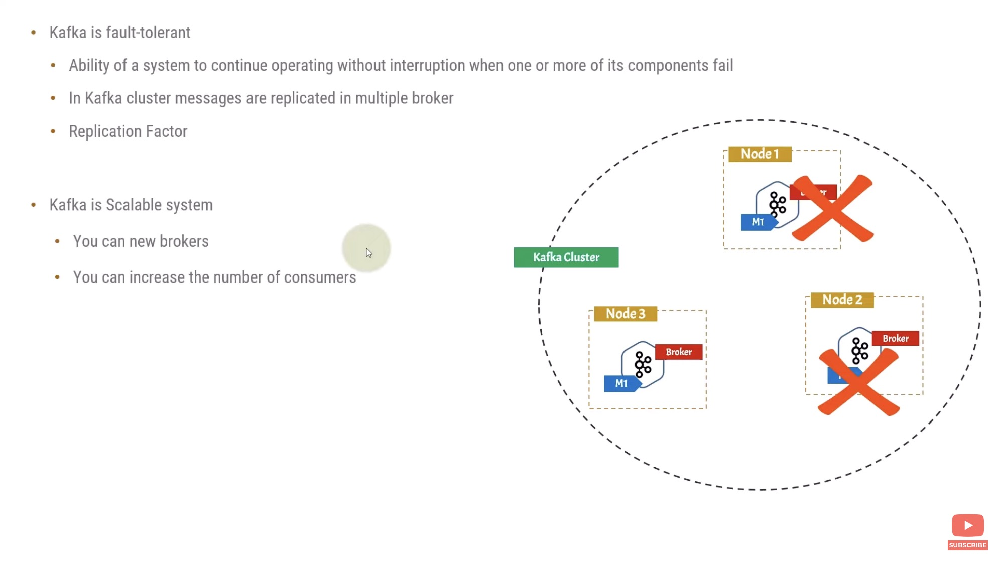

# kafka_spring_boot
## Kafka
- It is a distributed platform/application
- A kafka cluster is made up of more than one kafka server
- In production, we generally use kafka cluster instead of one single kafka server
- Each of the kafka server is referred to as broker
---

### Kafka Architecture

#### Kafka server
- Each kafka server can have multiple topics and in turn each topic can have multiple partitions
- The publishers who publish the message to topics are connected to the partition of the topic
- Means each publisher publishes the message to partition of the topic
#### Kafka consumer
- Kafka topic can have multiple consumer listening for events
- Kafka consumer can not be standalone, it has to be a part of consumer group
#### Zookeeper
- It is distributed, open-source configuration, synchronization service
- It acts as control plane in the kafka architecture

### Kafka topic

- Topic can be considered as logical entity
- In Kafka cluster each topic is present in the every cluster node

### Kafka producer

- Kafka producer can be tightly coupled to a specific partition also
